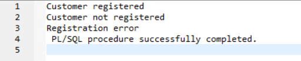

# database-project-Zakaria7522
database-project-Zakaria7522 created by GitHub Classroom

# Restaurent Management System
## Schema 


 <!-- 1. ### Connect system -->
 ##    Connect System and User Creation
 ```
 connect system
 create user hossain identified by hossain;
 grant all privileges to hossain;
 connect hossain
 ```
 > enter password
 <br><br>
 

 ## Set line and page size
 ```
 show pagesize
 set pagesize 200
 show linesize
 set linesize 250
```


## Checking existing tables in database
```
select table_name from user_tables;
```


# DDL
##  Drop table
```
drop table Bills;
drop table Orderss;
drop table Products;
drop table Restaurent;
drop table Reservation;
drop table Customer;
```
## Create table
```
create table Customer (customer_id number(20),
			first_name varchar(30),
			last_name varchar(30),
			username varchar(20),
			email varchar(50),
			phone varchar(11),
			password varchar(20),
			primary key(customer_id));

create table Reservation(reservation_id number(20),
			customer_id number(20),
			table_no number(20),
			booking_date date,
			expected_date date,
			primary key(reservation_id),
			foreign key(customer_id) references Customer(customer_id));

create table Restaurent(rs_id number(20),
			rs_name varchar(50),
			rs_email varchar(50),
			rs_phone varchar(11),
			link varchar(100),
			primary key(rs_id));

create table Products(product_id number(20),
			rs_id number(20),
			product_name varchar(50),
			price number(10),
			primary key(product_id),
			foreign key(rs_id) references Restaurent(rs_id));

create table Orderss    (order_id number(20),
			customer_id number(20),
			product_id number(20),
			product_name varchar(50),
			quantity number(5),
			primary key(order_id),
			foreign key(customer_id) references Customer(customer_id),
			foreign key(product_id) references Products(product_id));

create table Bills     (bill_no number(20),
			customer_id number(20),
			product_name varchar(50),	
			quantity number(5),
			total_price number(20),
			primary key(bill_no),
			foreign key(customer_id) references Customer(customer_id));
```
##  Add column in the table
>Adding a column naming location in the Customer table
```
alter table Customer add location char(20);
```
## Modify column definition in the table
> Changing data type from varchar(20) to varchar(23)
```
alter table Customer modify location varchar(23);
```
## Renaming column
>Renaming column name from location to location2
```
alter table Customer rename column location to location2;
```
## Drop column from the table
> Drop the column location2 from the table Customer
```
alter table Customer drop column location2;
```
# DML
## Inserting data into the table
```
insert into Customer values (1001,'Zakaria','Hossain','zakaria','zakahossain22@gmail.com',
				'01735828548','xakjfd');
insert into Customer values (1002,'Abu','Saeed','abusaeed','abusaeed@gmail.com',
				'01725628626','jbvksj');
insert into Customer values (1003,'Atique','Faisal','atique','atique@gmail.com',
				'01783832832','mvlxkmf');
insert into Customer values (1004,'Naimur','Rahaman','naimur','naimur@gmail.com',
				'01984323894','jfjlkf'); 
insert into Customer values (1005,'Asadullah','Galib','galib','galib@gmail.com',
				'01642394789','jhdjfh');
insert into Customer values (1006,'Tamim','Hossain','tamim','tamim@gmail.com',
				'01829834792','dksjff');
insert into Customer values (1007,'Habibur','Rahaman','habib','habib@gmail.com',
				'01829834782','jdjske');
insert into Customer values (1008,'Zobayer','Abedin','zobayer','zobayer@gmail.com',
				'01829834726','sdjfds');
insert into Customer values (1009,'Fahim','Abrar','wasi','wasi@gmail.com',
				'01828234792','fdsfgs');
insert into Customer values (1010,'Naiyem','Islam','naiyem','naiyem@gmail.com',
				'01829294792','dk1cff');	


insert into  Reservation values (2001,1002,101,TO_DATE ('2023/03/12','yyyy/mm/dd'),
					TO_DATE ('2023/03/13','yyyy/mm/dd'));
insert into  Reservation values (2002,1003,102,TO_DATE ('2023/03/14','yyyy/mm/dd'),
					TO_DATE ('2023/03/15','yyyy/mm/dd'));
insert into  Reservation values (2003,1004,105,TO_DATE ('2023/03/16','yyyy/mm/dd'),
					TO_DATE ('2023/03/17','yyyy/mm/dd'));
insert into  Reservation values (2004,1006,107,TO_DATE ('2023/03/18','yyyy/mm/dd'),
					TO_DATE ('2023/03/19','yyyy/mm/dd'));
insert into  Reservation values (2005,1002,101,TO_DATE ('2023/03/20','yyyy/mm/dd'),
					TO_DATE ('2023/03/21','yyyy/mm/dd'));
insert into  Reservation values (2006,1003,102,TO_DATE ('2023/03/12','yyyy/mm/dd'),
					TO_DATE ('2023/03/13','yyyy/mm/dd'));
insert into  Reservation values (2007,1004,105,TO_DATE ('2023/03/14','yyyy/mm/dd'),
					TO_DATE ('2023/03/18','yyyy/mm/dd'));
insert into  Reservation values (2008,1006,107,TO_DATE ('2023/03/28','yyyy/mm/dd'),
					TO_DATE ('2023/03/30','yyyy/mm/dd'));
insert into  Reservation values (2009,1002,109,TO_DATE ('2023/03/13','yyyy/mm/dd'),
					TO_DATE ('2023/03/17','yyyy/mm/dd'));
insert into  Reservation values (2010,1002,104,TO_DATE ('2023/03/19','yyyy/mm/dd'),
					TO_DATE ('2023/03/20','yyyy/mm/dd'));	


insert into Restaurent values (3001,'The Garden Kitchen', 'garden@gmail.com','01848938463','www.gardenkitchen.com');
insert into Restaurent values (3002,'Latest Recipe', 'latestrecipe@gmail.com','01883004802','www.latestrecipe.com');
insert into Restaurent values (3003,'Glazed','glazed@gmail.com','01842394935','www.glazed.com');
insert into Restaurent values (3004,'Prego', 'prego@gmail.com','01584348963','www.prego.com');
insert into Restaurent values (3005,'Crème De La Crème Cafe', 'creme@gmail.com','01894138463','www.cremede.com');
insert into Restaurent values (3006,'Pizza Hut', 'pizzahut@gmail.com','01889184802','www.pizzahut.com');
insert into Restaurent values (3007,'Summerfields by Sarina','sarina@gmail.com','01842399245','www.sarina.com');
insert into Restaurent values (3008,'Hazir Biriani', 'hazi@gmail.com','01584319963','www.hazirbiriyani.com');
insert into Restaurent values (3009,'The White Canary Cafe','canary@gmail.com','01842124935','www.canary.com');
insert into Restaurent values (3010,'Latitude 23', 'latitude@gmail.com','01581748963','www.latitude.com');


insert into Products values (4001,3001,'Kacchi Biriyani',350);
insert into Products values (4002,3002,'Beef Kala Bhuna',220);
insert into Products values (4003,3003,'Sheek Kebab with Naan',270);
insert into Products values (4004,3004,'Falooda',250);
insert into Products values (4005,3001,'Tehari',350);
insert into Products values (4006,3002,'Fuchka',120);
insert into Products values (4007,3003,'Chowmein',140);
insert into Products values (4008,3004,'Lassi',80);
insert into Products values (4009,3007,'Pizza',220);
insert into Products values (4010,3008,'Burger',150);


insert into Orderss values (5001,1001,4001,'Kacchi Biriyani',5);
insert into Orderss values (5002,1002,4002,'Beef Kala Bhuna',6);
insert into Orderss values (5003,1003,4003,'Sheek Kebab with Naan',12);
insert into Orderss values (5004,1004,4004,'Kacchi Biriyani',7);
insert into Orderss values (5005,1001,4006,'Fuchka',5);
insert into Orderss values (5006,1002,4007,'Chowmein',6);
insert into Orderss values (5007,1003,4009,'Pizza',12);
insert into Orderss values (5008,1004,4008,'Lassi',7);
insert into Orderss values (5009,1005,4001,'Kacchi Biriyani',5);
insert into Orderss values (5010,1006,4002,'Beef Kala Bhuna',6);


insert into Bills values (6001,1001,'Kacchi Biriyani',5,1750);
insert into Bills values (6002,1002,'Beef Kala Bhuna',6,1320);
insert into Bills values (6003,1003,'Sheek Kebab with Naan',12,3240);
insert into Bills values (6004,1004,'Kacchi Biriyani',7,2450);
insert into Bills values (6005,1001,'Fuchka',5,600);
insert into Bills values (6006,1002,'Chowmein',6,840);
insert into Bills values (6007,1003,'Pizza',12,2640);
insert into Bills values (6008,1004,'Lassi',7,560);
insert into Bills values (6009,1005,'Kacchi Biriyani',5,1750);
insert into Bills values (60010,1006,'Beef Kala Bhuna',6,1320);
```
### Customer table


### Reservation table


### Restaurent table


### Products table


### Orderss table


### Bills table


## Unique constraint violation
```
insert into Orderss values (5001,1011,4001,'Kacchi Biriyani',5);
```


> This gives an error while inserting data in the Orderss table.Because the foreign key customer_id value 1011 does not exists in the Customer table
## Displaying table data
```
select * from Products where rs_id=3001;
```


## Updating data in a table
```
update Customer set first_name='Naeem' where customer_id=1010;
```
## Deleting row from a table
```
delete from  Customer where customer_id=1007;
```
## Union 
```
select first_name,last_name,username from Customer where last_name like '%Hossain' union select first_name,last_name,username from Customer where first_name like 'Naiyem%';
```


## Intersect
```
select product_id,product_name from Orderss intersect select product_id,product_name from Products;
```


## Except(Minus)
> Except not supported in Oracle
```
select product_name from Products minus select product_name from Orderss;
```


# Save the SQL command output
## In csv file
```
SET MARKUP XML ON
SET HEADING OFF
SET PAGESIZE 0
SET FEEDBACK OFF
SPOOL D:\UserFolder\Desktop\DatabaseProject\Project\database-project-Zakaria7522\file.csv
SELECT *
FROM dept;
SPOOL OFF
```
## In xml file
```
SET COLSEP ","
SET HEADING OFF
SET PAGESIZE 0
SET FEEDBACK OFF
SPOOL D:\UserFolder\Desktop\DatabaseProject\Project\database-project-Zakaria7522\file.xml
SELECT *
FROM dept;
SPOOL OFF
```
## In txt file
```
SPOOL D:\UserFolder\Desktop\DatabaseProject\Project\database-project-Zakaria7522\file.txt
SELECT *
FROM dept;
SPOOL OFF
```
## Aggregate function
### Count
```
select count(*) as number_of_customer from Customer;
```
### Distinct count
```
select count(distinct customer_id) as number_of_distinct_order from Orderss;
```
### Average and total
```
select avg(total_price) from Bills;
select sum(total_price) from Bills;
```
### Max and min
```
select max(total_price) from Bills;
select min(total_price) from Bills;
```


## Group by
```
select customer_id, avg(total_price) from Bills group by customer_id;
```


## Having
```
select customer_id, avg(total_price) from Bills group by customer_id having avg(total_price)>1200;
```


## Nested subquery
```
select username from Customer where customer_id=(select customer_id from Orderss where product_name='Sheek Kebab with Naan');
```


## Set Membership(AND, OR,NOT)
### AND
```
select * from Orderss where customer_id=1001 and quantity=5;
```
### OR
```
select * from Orderss where customer_id=1001 or product_id=4002;
```
### NOT
```
select * from Orderss where quantity not in (5,6);
```


## some/all/exists/unique
```
select * from Customer where customer_id> some(select customer_id from Orderss where customer_id>=1005);

select * from book where book_no> all(select book_no from book where book_no>=14);

select * from Customer where customer_id<1006 and exists(select * from Orderss where customer_id <1005);

```

## String operations
### String beginning with 'A'
```
SELECT first_name FROM Customer WHERE first_name LIKE 'A%';
```


### String ending with 'r'
```
SELECT first_name FROM Customer WHERE first_name LIKE '%r';
```


### String containing 'ss'
```
SELECT first_name,last_name FROM Customer WHERE last_name LIKE '%ss%';
```


## Join operations
### Natural join
```
select * from Products natural join Orderss;
```


### Inner join
```
select username,product_name from Customer join Orderss using(customer_id);
```


### Left outer join
```
select username,product_name from Customer left outer join Orderss using(customer_id);
```


### Right outer join
```
select username,product_name from Customer right outer join Orderss using(customer_id);
```


### Full outer join
```
select username,product_name from Customer full outer join Orderss using(customer_id);
```


# Views
```
create view Restaurent_details as select rs_name,rs_phone from Restaurent;
select * from Restaurent_details;
```
# Constraints on a Single Relation
> rs_name can't be null and rs_phone max length 11
```
create table Restaurents(rs_id number(20),
			rs_name varchar(50) not null,
			rs_email varchar(50),
			rs_phone varchar(11),
            CONSTRAINT max_length_constraint CHECK (LENGTH(rs_phone) <= 11),
			link varchar(100),
			primary key(rs_id));
```			
# PL/SQL
## Variable declaration and print value
```
set serveroutput on
declare 
Customer_id Customer.customer_id%type;
First_name Customer.first_name%type;

begin
select customer_id,first_name into Customer_id,First_name from Customer where customer_id=1004;
dbms_output.put_line('CUSTOMER ID : '||Customer_id|| ' FIRST NAME : '||First_name);
end;

/
```


## Insert and set default value
```
set serveroutput on
declare 
Product_id Products.product_id%type:=4011;
Restaurent_id Products.rs_id%type:=3005;
Product_name Products.product_name%type:='Bhel Puri';
Price Products.price%type:=120;

begin
insert into Products values(Product_id,Restaurent_id,
Product_name,Price);
select * into Product_id,Restaurent_id,Product_name,
Price from Products where product_id=4011;
dbms_output.put_line('PRODUCT ID : '||Product_id||
' RESTAURENT ID : '||Restaurent_id||' PRODUCT NAME : 
'||Product_name||' PRICE : '||Price);
end;
/
```


## Row type
```
set serveroutput on
declare 
Products_row Products%rowtype;
begin
select product_id,product_name,price into 
Products_row.product_id,Products_row.product_name,
Products_row.price from Products where product_id=4010;
dbms_output.put_line('PRODUCT ID : '||Products_row.product_id
||' PRODUCT NAME : '||Products_row.product_name);
end;
/
```


## Cursor and row count
```
set serveroutput on
declare 
Product_id Products.product_id%type;
Restaurent_id Products.rs_id%type;
Product_name Products.product_name%type;
Price Products.price%type;
cursor products_cursor is select * from Products
where product_id<4006;

BEGIN
open products_cursor;
fetch products_cursor into Product_id,Restaurent_id,
Product_name,Price;
while products_cursor%found loop
dbms_output.put_line('PRODUCT ID: '||Product_id||
 ' RESTAURENT ID: '||Restaurent_id || ' PRODUCT NAME:
  ' ||Product_name|| ' PRICE: '||Price);
dbms_output.put_line('Row count: '|| products_cursor%rowcount);
fetch products_cursor into Product_id,Restaurent_id,
Product_name,Price;
end loop;
close products_cursor;
end;
/
```


# Array and Loop
## Array declaration
```
TYPE NAMEARRAY IS VARRAY(5) OF Customer.customer_name%type;
```
## Initializing variable
```
A_NAME NAMEARRAY:=NAMEARRAY();
```
## For and While loop
```
set serveroutput on
declare 
  counter number;
  Username Customer.username%type;
  TYPE NAMEARRAY IS VARRAY(5) OF Customer.username%type; 
  A_NAME NAMEARRAY:=NAMEARRAY();

begin
  counter:=1;
  for x in 1001..1005  
  loop
    select username into Username from Customer where customer_id=x;
    A_NAME.EXTEND();
    A_NAME(counter):=Username;
    counter:=counter+1;
  end loop;
  counter:=1;
  WHILE counter<=A_NAME.COUNT 
    LOOP 
    DBMS_OUTPUT.PUT_LINE(A_NAME(counter)); 
    counter:=counter+1;
  END LOOP;
end;
/
```


## ARRAY without extend() function
```
set serveroutput on
declare 
  counter number:=1;
  Username Customer.username%type;
  TYPE NAMEARRAY IS VARRAY(5) OF Customer.username%type; 
  A_NAME NAMEARRAY:=NAMEARRAY('name1','name2','name3');
  
begin
  counter:=1;
  for x in 1001..1003  
  loop
    select username into Username from Customer where customer_id=x;
    A_NAME(counter):=Username;
    counter:=counter+1;
  end loop;
  counter:=1;
  WHILE counter<=A_NAME.COUNT 
    LOOP 
    DBMS_OUTPUT.PUT_LINE(A_NAME(counter)); 
    counter:=counter+1;
  END LOOP;
end;
/
```


## If-else
```
-- If-else
set serveroutput on
declare 
  counter number:=1;
  Username Customer.username%type;
  TYPE NAMEARRAY IS VARRAY(5) OF Customer.username%type; 
  A_NAME NAMEARRAY:=NAMEARRAY('name1','name2','name3');
  
begin
  counter:=1;
  for x in 1001..1003  
  loop
    select username into Username from Customer where customer_id=x;
    if Username='zakaria'
    then
    dbms_output.put_line('Customer registered');
    elsif Username='abusaeed'
    THEN
    dbms_output.put_line('Customer not registered');
    else
    dbms_output.put_line('Registration error');
    end if;
  end loop;
end;
```


## Creating procedure
```
CREATE OR REPLACE PROCEDURE proc2(
  var1 IN NUMBER,
  var2 OUT VARCHAR2,
  var3 IN OUT NUMBER
)

AS
t_show CHAR(30);

BEGIN
t_show := 'From procedure: ';
  SELECT username INTO var2 FROM Customer WHERE
   customer_id=1005;
  var3 := var1 + 1; 
  DBMS_OUTPUT.PUT_LINE(t_show|| ', Username is : '
  ||var2 || ', Var1 is : ' || var1);
END;
/
```
## Calling procedure
```
set serveroutput on
declare 
Customer_id Customer.customer_id%type:=1004;
Username Customer.username%type;
extra number;
begin
proc2(Customer_id,Username,extra);
end;
/
```


## Creating function
```
set serveroutput on
create or replace function fun(var1 in varchar) 
return varchar AS
value Customer.username%type;

begin
  select username into value from Customer where 
  customer_id=var1; 
   return value;
end;
/
```
## Calling function
```
set serveroutput on
declare 
value varchar(20);

begin
value:=fun(1007);
dbms_output.put_line(value);
end;
/
```


## Drop procedure and function
```
drop procedure proc2;
drop function fun;
```